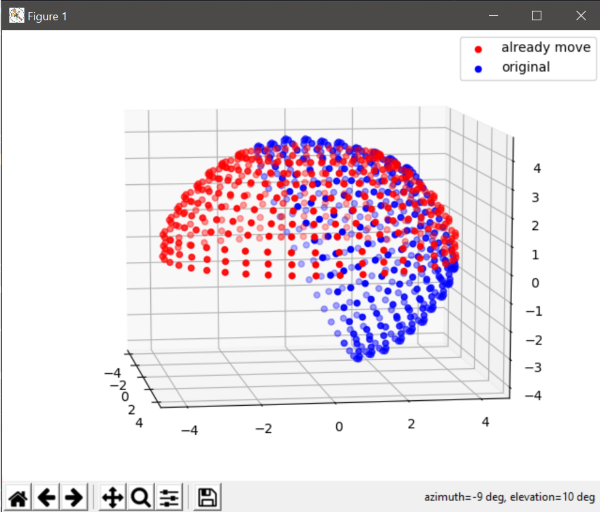

# deeparc2normalize
normalize deeparc camera to plane [0,0]



## installation
```shell
pip install git+https://github.com/pureexe/deeparc2normalize/
```

## usage
```shell
deeparc2normalize -i <colmap sparse model dir> -o <output dir>
```
